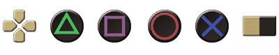

  
These textures replace the default Xbox 360 buttons with PS4 buttons and should resemble the UI look of Dark Souls 3 on the PS4. Optionally there are now the Dark Souls: REMASTERED PS4 buttons available which I ported to the Prepare to Die Edition.

**Files provided:**
- ``40fbc4ad.dds`` - Texture for all the buttons
- ``43a2b23a.dds`` - Texture for the Menu and Arrow HUD

  
- **Dark Souls Prepare to Die Edition** on Steam  
	Steam input, enabled Playstation Configuration Support (see images)
- [DSfix](https://www.nexusmods.com/darksouls/mods/19)
- Enable DSfix' texture override.  
	To do so edit DSfix.ini, search for enableTextureOverride 0 and change it to enableTextureOverride 1

**NOTE:** Turn OFF the in-game Anti-Aliasing option, otherwise you will run into graphical issues.

  
  
**PS4 Buttons**  
Main version (if you are unsure, download this version)

────────────────────────────────────────  

  
**PS4 Buttons - Small**  
Smaller version of the buttons. Recommended if the default dimensions feel oversized.
Some buttons could appear too small on resolutions below 1080p.

────────────────────────────────────────  

  
**PS4 Buttons - DSR**  
Dark Souls: Remastered PS4 buttons with touchpad icons for Share and Options.

────────────────────────────────────────  

  
**PS4 Buttons - DSR (Buttons)**  
Dark Souls: Remastered PS4 buttons with button icons for Share and Options.

  
**Automatic**  
Click the Vortex or Mod Manger Download button.

**Manual**  
Extract\* the textures into DSfix' tex_override folder.
Path: \Dark Souls Prepare to Die Edition\DATA\dsfix\tex_override

\* 7zip required to extract the archive (or any other program which can open this file type)
